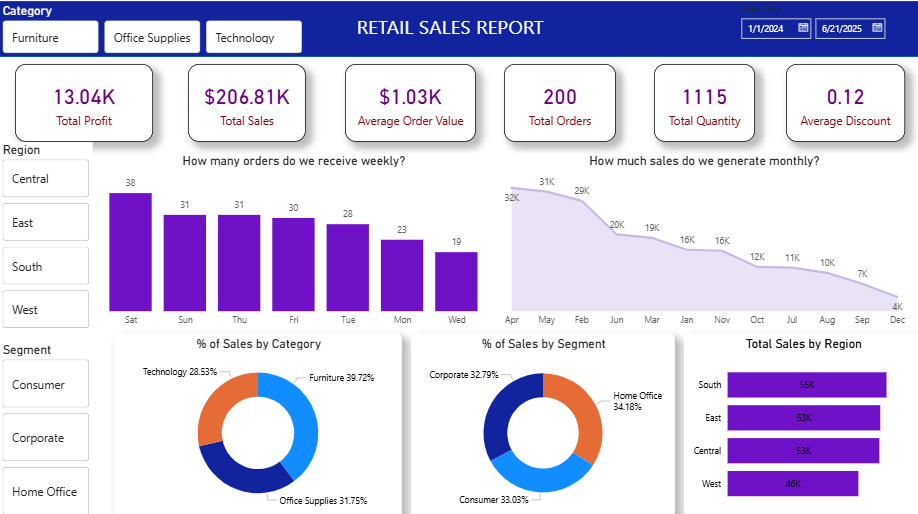

# 📊 Retail Sales Analysis using SQL Server & Power BI

## 📌 Project Overview
This project analyzes retail sales data to uncover insights related to sales performance, profitability, customer behavior, and regional trends. The project combines SQL for data analysis and Power BI for interactive dashboard creation, enabling data-driven business decisions.

---

## 🎯 Project Objective
The main objectives of this project are:

- Analyze overall sales and profit performance.
- Identify top-performing categories, segments, and regions.
- Understand customer purchasing patterns.
- Measure the impact of discounts on profitability.
- Generate actionable business recommendations through data visualization.

---

## 📂 Dataset Information

**Dataset Name:** Retail Sales Analysis Dataset

**Number of Records:** 200+

**Number of Columns:** 21

## Dataset Columns

| Column Name | Description |
|------------|-------------|
| Row_ID | Unique identifier for each record |
| Order_ID | Unique identifier for each order |
| Order_Date | Date on which the order was placed |
| Ship_Date | Date on which the order was shipped |
| Ship_Mode | Shipping method used for delivery |
| Customer_ID | Unique identifier for each customer |
| Customer_Name | Name of the customer |
| Segment | Customer segment (Consumer, Corporate, Home Office) |
| Country | Country where the order was placed |
| City | City where the order was placed |
| State | State where the order was placed |
| Postal_Code | Postal code of the customer's location |
| Region | Geographic region of the order (East, West, Central, South) |
| Product_ID | Unique identifier for each product |
| Category | Main product category (Office Supplies, Furniture, Technology |
| Sub_Category | Sub-category of the product |
| Product_Name | Name of the product |
| Sales | Revenue generated from the order |
| Quantity | Number of units sold |
| Discount | Discount applied to the order |
| Profit | Profit earned from the order |

---

## 🗄️ SQL Analysis

The following analyses were performed using SQL Server Management Studio (SSMS) for data extraction and aggregation, forming the foundation for Power BI Dashboard. All queries are contained within the "Retail_Sales_Analysis.sql" file.

### KPI Analysis
- Total Sales
- Total Profit
- Total Orders
- Average Order Value
- Total Quantity Sold
- Average Discount

### Business Analysis
- Region-wise Sales Analysis
- Category-wise Performance Analysis
- Segment-wise Sales Distribution
- City-wise Sales Analysis
- Profit Margin Analysis
- Discount Distribution Analysis
- Repeat Customer Analysis
- Top Customers by Revenue
- Monthly Sales Trend Analysis
- Top Products by Sales

### SQL Concepts Used
- SELECT
- WHERE
- GROUP BY
- ORDER BY
- HAVING
- Aggregate Functions
- CASE Statements
- Subqueries
- DISTINCT
- Date Functions

---

## 📈 Power BI Dashboard

The insights from sql analysis are visualized in an interactive dashboard created with Power Bi.

### KPI Cards
- Total Sales
- Total Profit
- Average Order Value
- Total Orders
- Total Quantity
- Average Discount

### Visualizations
- Weekly Order Trend
- Monthly Sales Trend
- Sales by Category
- Sales by Segment
- Total Sales by Region
- Interactive Slicers (Category, Region, Segment, Date)

---

## 🔍 Key Insights

- Furniture category contributed the highest percentage of total sales.
- South region generated the highest revenue.
- A small group of customers contributed significantly to overall revenue.
- Higher discounts negatively impacted profit margins.
- Consumer and Home Office segments generated similar sales contributions.
- Monthly sales showed fluctuations, indicating seasonal demand patterns.

---

## 💡 Business Recommendations

- Reduce excessive discounts on low-profit products.
- Focus marketing campaigns on high-performing regions.
- Increase inventory for top-selling products.
- Implement customer loyalty programs for repeat customers.
- Monitor low-performing categories and optimize pricing strategies.

---

## 🛠️ Tools & Technologies

| Tool  | Purpose |
|-------------------|---------|
| SQL Server Management Studio (SSMS) | Used for data storage, querying, and business analysis using SQL |
| SQL | Performed data extraction, aggregation, KPI calculations, and business analysis |
| Power BI | Created interactive dashboards and visualized business insights |
| Microsoft Excel | Used for initial data review and validation |

---

## 🚀 Skills Demonstrated

### SQL
- Data Extraction
- Data Aggregation
- Business Query Writing
- KPI Calculation
- Data Analysis

### Power BI
- Data Modeling
- Dashboard Design
- DAX Measures
- Data Visualization
- Interactive Reporting

### Business Analysis
- KPI Development
- Business Insights Generation
- Data Storytelling
- Recommendation Building

---

## 📁 Project Files

| File Name | Description |
|-----------|-------------|
| `Retail_Sales_Analysis.sql` | Contains all SQL queries used for data exploration, KPI calculations, and business analysis. |
| `Retail_Sales_Analysis_Dataset.csv` | Source dataset containing retail sales transaction records used for analysis. |
| `Retail_Sales_Analysis.pbix` | Power BI dashboard file containing interactive visualizations and business insights. |
| `README.md` | Project documentation including overview, objectives, methodology, insights, and project details. |

---

## 📬 Contact

**Author:** Arpit Khandelwal

💻 GitHub: [arpitkhandelwal28](https://github.com/arpitkhandelwal28)

⭐ If you found this project useful, please consider giving it a star on GitHub.

---
